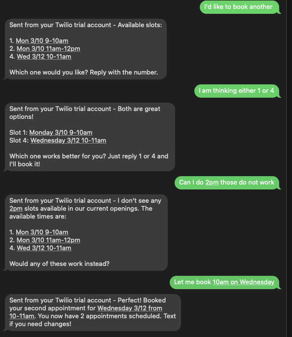

# greenhorn

AI assistant using Claude.

## stack

- **Runtime**: Node.js 20
- **Framework**: Express
- **SMS**: Twilio
- **AI**: Anthropic Claude
- **Database**: PostgreSQL
- **Container**: Docker
- **CI/CD**: GitHub Actions
- **Hosting**: Railway


## local development
```bash
# Install dependencies
cd apps/api
npm install

# Add your environment variables
cp .env.example .env

# Run locally
npm run dev

# Run in Docker
docker build -t greenhorn .
docker run -p 3000:3000 greenhorn
```

## environment variables

See `.env.example`.

## ci/cd

Every push to `main`:
1. Starts the server and hits `/health`
2. Builds the Docker image
3. Railway auto-deploys if both pass

## sms idea
```
user texts Twilio number
        ↓
Twilio POSTs to /webhook/sms
        ↓
webhook.js pulls body/from req.body
        ↓
reply.js sends message/history to Claude
        ↓
Claude replies
        ↓
webhook.js wraps reply in Twilio XML
        ↓
Twilio delivers it as sms to user
```
## security
every request to `/webhook/sms` is validated against Twilio signature before being processed. This ensures fake requests do not use Claude API tokens. 

## database schema
```
users                appointments           availability
─────────────────    ──────────────────    ──────────────────
id                   id                    id
phone_number         user_id               start_time
name                 availability_id       end_time
created_at           status                is_booked

## example


       